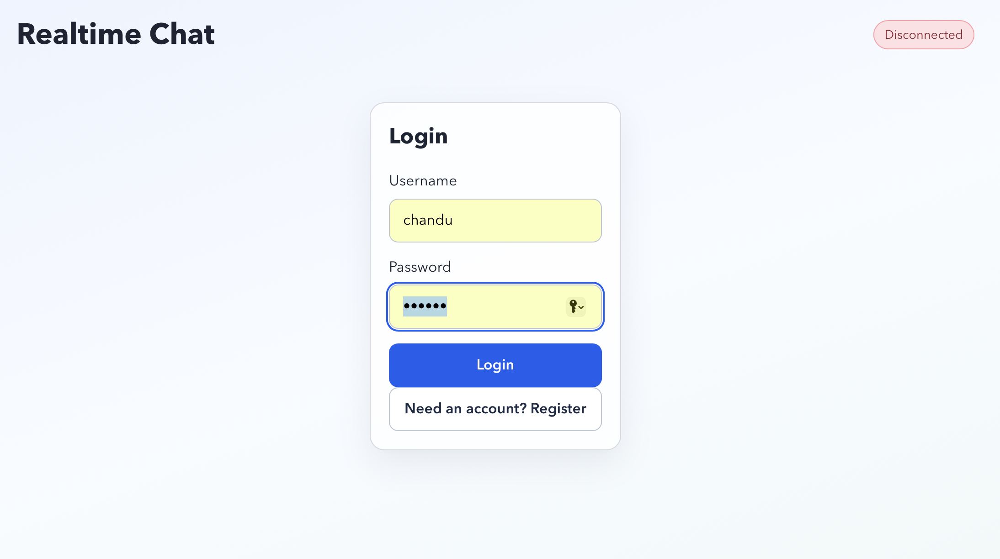
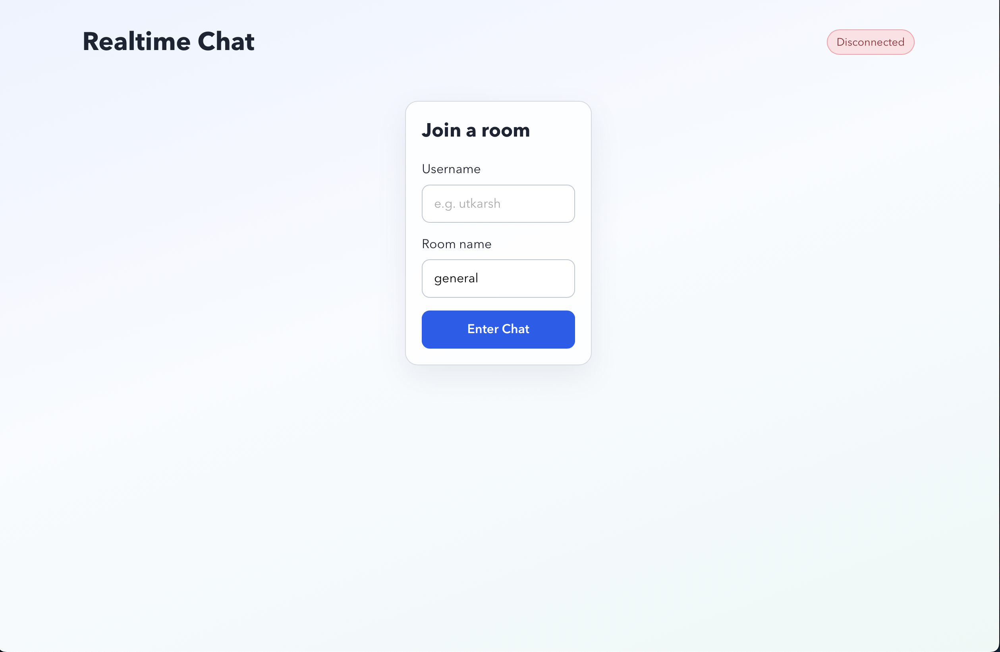

# Realtime Chat App 

A full-stack realtime chat application built to demonstrate intern-level software engineering skills: frontend state management, realtime communication, backend event handling, room-based architecture, and clear project documentation.

## Project Goal

Build a chat system where multiple users can:

- Register/login and join a named room
- See online users in that room
- Send and receive messages instantly
- Receive system updates when users join or leave

## Tech Stack

- Frontend: React + Vite + Socket.IO Client
- Backend: Node.js + Express + Socket.IO
- Auth: JWT + bcrypt password hashing
- Database: MongoDB + Mongoose
- Transport: WebSockets (Socket.IO fallback support)

## Core Features

- Room-based chat
- Realtime message delivery
- Online users list per room
- System messages for join/leave activity
- Per-room persisted history in MongoDB (last 100 messages shown)
- JWT-based login and registration
- Health endpoint for backend status check

## Project Structure

```text
project1/
	client/        # React frontend
	server/        # Express + Socket.IO backend
	README.md
```

## Project Screenshots

### Authentication Screen




### Join Room Screen



### Chat Room Screen


## How It Works

### 1. User joins room

1. User logs in/registers, then enters `room` in frontend
2. Frontend emits `join_room`
3. Server:
	 - Joins the socket to that room
	 - Stores user in room user state
	 - Sends room history to that socket
	 - Broadcasts updated user list to room
	 - Emits a system join message to other room users

### 2. User sends message

1. Frontend emits `send_message` with room + text
2. Server:
	 - Builds normalized message payload
	 - Saves it in room history
	 - Emits message to all sockets in that room

### 3. User disconnects

1. Server removes user from room state
2. Server emits updated user list
3. Server emits a system leave message

## Backend State Model

The backend keeps active room users in memory and message history in MongoDB:

- `roomUsers: Map<room, Map<socketId, { socketId, username }>>`

MongoDB collections:

- `users` for account credentials/profile
- `messages` for persisted room messages

`message` object shape:

```json
{
	"id": "socketId-timestamp",
	"room": "general",
	"username": "alice",
	"message": "hello",
	"createdAt": "ISO-8601",
	"type": "user"
}
```

## Socket Events

### Client -> Server

- `join_room` with `{ room }`
- `send_message` with `{ room, message }`

### Server -> Client

- `room_history` with `message[]`
- `receive_message` with `message`
- `user_list` with `user[]`

## Local Setup

### Prerequisites

- Node.js 18+
- npm 9+
- MongoDB running locally or remotely

### 0) Configure backend env

```bash
cd server
cp .env.example .env
```

Set values in `.env`:

- `PORT` (default 4000)
- `MONGODB_URI` (MongoDB connection string)
- `JWT_SECRET` (long random secret)

### 1) Start backend

```bash
cd server
npm install
npm run dev
```

Backend URL: `http://localhost:4000`

Health check:

```bash
curl http://localhost:4000/health
```

### 2) Start frontend

Open a second terminal:

```bash
cd client
npm install
npm run dev
```

Frontend URL: `http://localhost:5173`

## NPM Scripts

### Backend (`server/package.json`)

- `npm run dev` starts server with nodemon
- `npm run start` starts server with node

### Frontend (`client/package.json`)

- `npm run dev` starts Vite dev server
- `npm run build` creates production build
- `npm run preview` previews production build

## Testing Realtime Chat

1. Open `http://localhost:5173` in normal browser window
2. Open the same URL in an incognito/private window
3. Register/login in both windows with two different accounts
4. Join the same room in both windows
5. Send messages from both windows and refresh to verify message persistence

## Current Limitations

- No typing indicators or read receipts
- No file/image sharing

## Roadmap (Production Improvements)

- Add refresh tokens and secure httpOnly cookie flow
- Add role-based room moderation
- Add Redis adapter for horizontal scaling
- Add rate limiting and input moderation
- Add Docker and deployment pipeline

## Troubleshooting

- If frontend does not connect, confirm backend is running on port 4000
- If port is busy, kill old process and restart
- If rooms are empty after restart, this is expected (presence is in-memory only)

